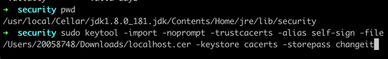

# SSL

## 1. RSA Asymmetric


* RSA Algorithm adalah algoritma yang dapat membuat public key dan private key yang secara matematical linked
* Alice dan Bob saling bertukar public key (encryptor)
* Dengan kata lain, ketika alice men-encrypt data yang akan dikirim ke bob, alice tidak dapat membukanya. Hanya Bob yang dapat membukanya, karena hanya bob yang mempunyai private key atas public key yg diberikan bob ke alice

## 2. How SSL Works

https://www.youtube.com/watch?v=33VYnE7Bzpk


* Pertama, client request https://google.com
* Server mempunyai 2 key, 1 private dan 1 public key
* Server mengirim public key ke client dengan SSL Certificate
* SSL Certificate adalah Certificate Authority atau CA, yang dipunyai oleh third party seperti google

* Ketika browser mendapat sertifikat, browser akan meng check sertifikat nya valid atau tidak
* Di dalam Sertifikat ternyata terdapat CA private key
* Browser baik  chrome atau pun firefox, ketika install pertama terdapat banyak CA public keys
* Dengan begitu, digital signature atau sertifikat dapat di validasi, dengan public key yg sudah ada di browser apakah dapat decrypt dengan CA private key (sertificate) (?)
* Setelah divalidasi, sertificate dapat dipercaya
* Setelahnya, https aktif dengan adanya simbol gembok, verifikasi selesai
* Setelahnya adalah exhange a secret dari client ke server
* Browser membuat 1 symetric key atau shared secret
* Browser tidak mau mengirim symetric key dengan plaint text
* Jadi, browser mengirim copy an symetric key dengan meng encrypt si symmetric key dengan public key yg diterima dari server dan mengirim ke server
* Ketika server menerima symmetric key, server akan meng decrypt dengan private key yg dipunya oleh si server
* Sekarang server punya symmetric key dari web
* Jadi pertukaran data setelah ini, akan di encypt dan decrypt dengan symetric key, tidak asymetic key
* Dengan kata lain, asymetric dipakai utk pertukaran symetric key
* Jadi SSL menggunakan asymmetric dan symmetric key algorithm

# 3. SSL One and Two Way

https://dzone.com/articles/implementing-one-way-and-two-way-ssl-mutual-authen#:~:text=In%20one%2Dway%20SSL%20authentication,identity%20of%20the%20client%20application.

* One way


 
 
* Two way


 
 

# 4. Keystore and TrustStore

* Keystrore: tempat private key disimpan
* Trust store: tempat public key disimpan

```
  keytool -genkey -alias https-example -storetype JKS -keyalg RSA -keysize 2048 -validity 365 -keystore https-example.jks
  Enter keystore password:
  Re-enter new password:
  What is your first and last name?
  [Unknown]:  cris
  What is the name of your organizational unit?
  [Unknown]:  rumahorbo
  What is the name of your organization?
  [Unknown]:  sidikalang
  What is the name of your City or Locality?
  [Unknown]:  Dairi
  What is the name of your State or Province?
  [Unknown]:  Sumut
  What is the two-letter country code for this unit?
  [Unknown]:  ID
  Is CN=cris, OU=rumahorbo, O=sidikalang, L=Dairi, ST=Sumut, C=ID correct?
  [no]:  yes

  Enter key password for <https-example>
  (RETURN if same as keystore password):

  Warning:
  The JKS keystore uses a proprietary format. It is recommended to migrate to PKCS12 which is an industry standard format using "keytool -importkeystore -srckeystore https-example.jks -destkeystore https-example.jks -deststoretype pkcs12".
```

# 5. Java HTTPS and Certificate
https://www.youtube.com/watch?v=rm9OKTSm-4A

Spring Boot with HTTPS Example | Tech Primers


 
 
1. Buat satu service controller dengan springboot seperti biasa


2. Tambahkan config ssl di application.properties

 
3. Buat sertificate self sign (sertifikat yang dibuat sendiri bukan dari CA) dengan keytool command.
```
   keytool -genkeypair -alias https-example -storetype JKS -keyalg RSA -keysize 2048 -validity 365 -keystore https-example.jks
```
-    -alias -> harus sama dengan alias pada application.properties yaitu https-example
-    -storetype -> harus sama dengan key-store-type pada application properties yaitu JKS
-    -keystore -> sama dengan key-store, classpath menandakan path utk keystore

4. Ketika command keytool di enter, step selanjutnya akan diminta password
* Password harus sama dengan key-password
* Password defaultnya adalah "changeit"
* Sebelumnya menggunakan password "password" tetapi gagal kena error "IO Exception: Keystore was tampered with …"
  https://stackoverflow.com/questions/16891182/keytool-error-keystore-was-tampered-with-or-password-was-incorrect
* Solusinya dengan mengganti password menjadi default yaitu "changeit"

5. Setelah password sudah diinput, step selanjutnya akan diminta
```
   What is your first and last name?
   [Unknown]:  localhost
```
* Jawaban utk first dan lastname harus "localhost" karena terdapat error ketika service yg dibuild dengan java, dan hit service ssl dengan rest template, error nya "CertificateException: No name matching ssl.someUrl.de found"
  https://stackoverflow.com/questions/3093112/certificateexception-no-name-matching-ssl-someurl-de-found

  Full version:
```
  keytool -genkeypair -alias https-example -storetype JKS -keyalg RSA -keysize 2048 -validity 365 -keystore https-example.jks
  Enter keystore password:
  Re-enter new password:
  What is your first and last name?
  [Unknown]:  localhost
  What is the name of your organizational unit?
  [Unknown]:
  What is the name of your organization?
  [Unknown]:
  What is the name of your City or Locality?
  [Unknown]:
  What is the name of your State or Province?
  [Unknown]:
  What is the two-letter country code for this unit?
  [Unknown]:
  Is CN=localhost, OU=Unknown, O=Unknown, L=Unknown, ST=Unknown, C=Unknown correct?
  [no]:  yes

  Enter key password for <https-example>
  (RETURN if same as keystore password):

  Warning:
  The JKS keystore uses a proprietary format. It is recommended to migrate to PKCS12 which is an industry standard format using "keytool -importkeystore -srckeystore https-example.jks -destkeystore https-example.jks -deststoretype pkcs12".

```
6. Pindahkan sertifikat ke folder resources project sll
7. Setelah itu "mvn clean install"
8. Setelah run aplikasi, access di web

9. Chrome menganggap tidak aman https nya karena self signed, bukan sertificate yang sudah berada di CA, that’s ok

# Bagaimana kalau service ini (ssl service) di hit atau diakses endpoint nya oleh service java lain?
1. Public certificate nya harus diinject ke java service pemanggilnya menggunakan keytool import
* Pertama, download public cert nya dengan akses di chrome dan klik export

* Hasilnya

* Setelahnya masukkan cert ke java, di folder security dengan sudo import
```
  sudo keytool -import -noprompt -trustcacerts -alias self-sign -file /Users/20058748/Downloads/localhost.cer -keystore cacerts -storepass changeit
```


 

 
* Kalau cert tidak dimasukkan, sbg contoh di run dengan java 11, yg blm di input certnya

2. CN harus "localhost" karena bakal error di service pemanggilnya
   "CertificateException: No name matching ssl.someUrl.de found"
   https://stackoverflow.com/questions/3093112/certificateexception-no-name-matching-ssl-someurl-de-found
 
 
